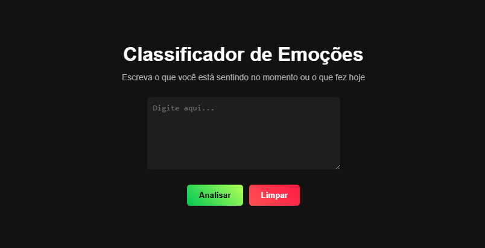
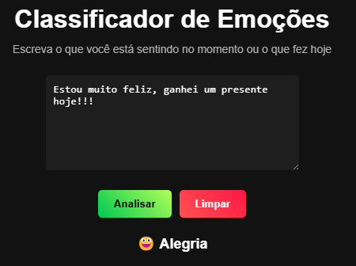

<h1 align="center">🧠 Classificador de Emoções</h1>

## Descrição do Projeto  
O **Classificador de Emoções** é uma aplicação web que utiliza **Inteligência Artificial** para identificar emoções a partir de textos inseridos pelos usuários. A análise é feita através do **TensorFlow.js**, permitindo que o modelo rode diretamente no navegador.  

## Funcionalidades do Projeto  
- Identifica emoções a partir de um texto inserido pelo usuário.  
- Exibe um emoji correspondente à emoção detectada.  
- Interface intuitiva e moderna com fundo escuro e botões estilizados.  
- Funciona 100% no navegador, sem necessidade de servidores ou APIs externas.  
- Permite limpar o campo e reiniciar a análise.  

## Testes de Software  
✅ **Teste de Depuração**: Foram realizados testes para garantir que a IA classifica corretamente as emoções.  
✅ **Teste de Funcionamento**: O projeto foi testado em diferentes navegadores para verificar sua compatibilidade.  
✅ **Teste Realizado**:  

## Tecnologias e Linguagens Utilizadas  

  

## Bibliotecas e Frameworks  

  

## Documentação  

-  [Vue.js](https://vuejs.org/)  
-  [TensorFlow.js](https://www.tensorflow.org/js)  
-  [Vite](https://vitejs.dev/)  
-  [GitHub](https://docs.github.com/)  
